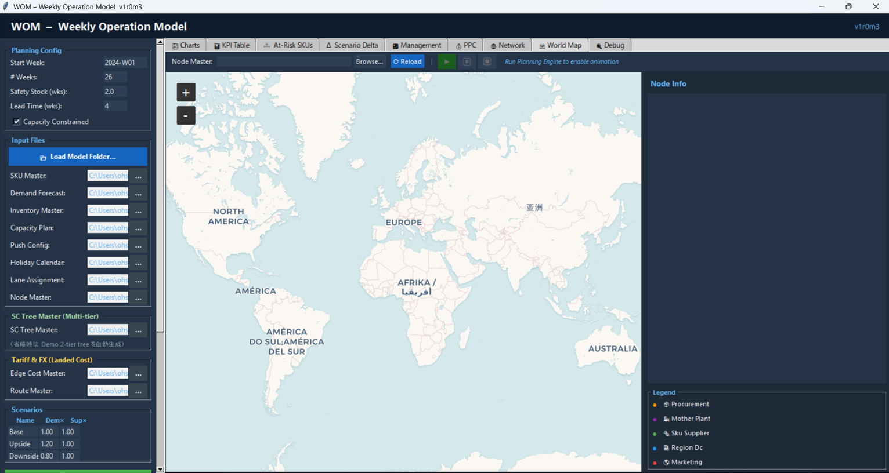
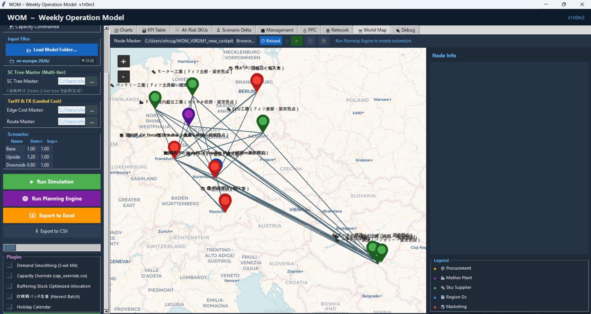
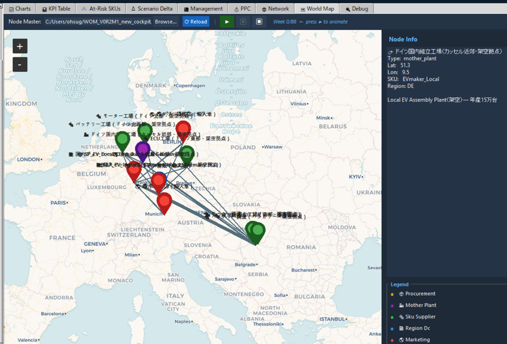
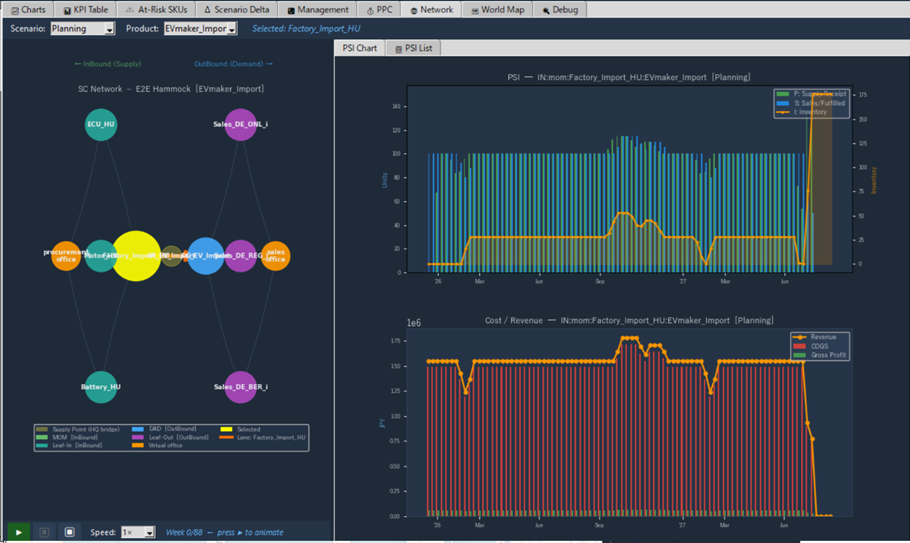
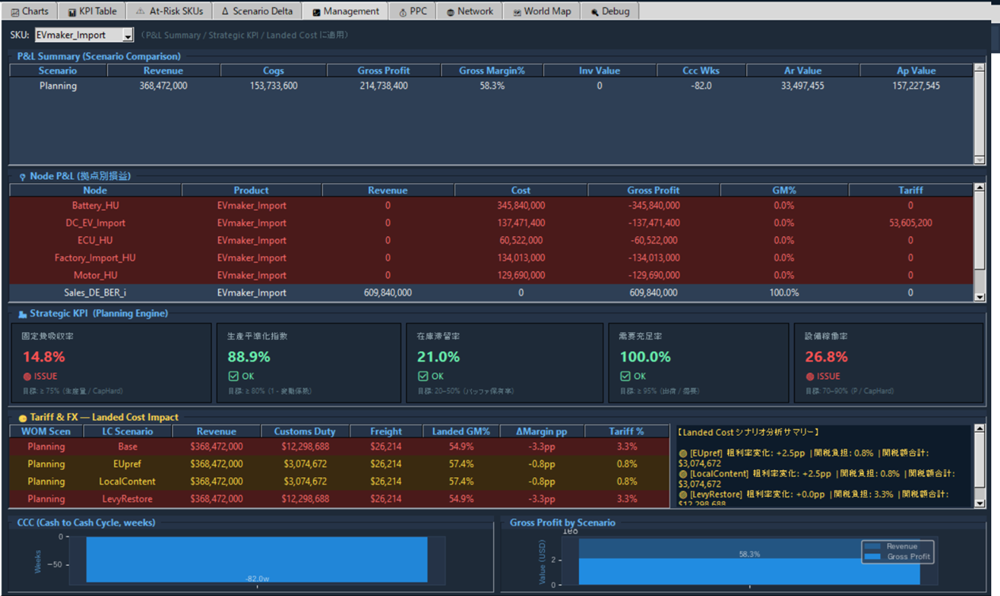
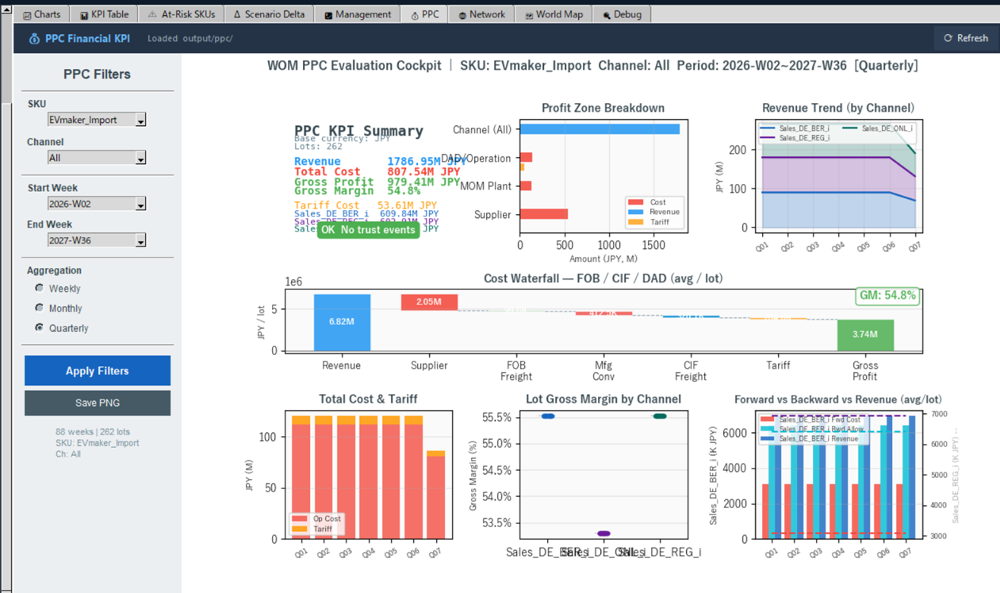

# WOM (Weekly Operation Model)

**週次PSIで、サプライチェーンの意思決定を「見える化」し、動かして確かめる。**

> **English (Summary)**
>
> WOM (Weekly Operation Model) is a Python/tkinter desktop tool that simulates an
> end-to-end supply chain — from raw material sourcing through manufacturing,
> distribution, and sales — on a **weekly PSI (Production / Sales / Inventory)**
> cadence. It connects three layers (Physical nodes on a world map → Planning
> logic (SC Tree + PSI) → Management KPIs / Profit-Price-Cost simulation), so you
> can see, week by week, how a demand shock, a capacity constraint, a tariff
> change, or a buffer-stock placement decision actually plays out — and how it
> shows up in P&L. It is not a solver that hands you "the optimal answer"; it is
> a model you run, watch, and reason about.
>
> Built as an ongoing AI-assisted "vibe coding" collaboration. For AI coding
> agents, the common entry point is `AGENTS.md`. Claude Code may also read
> `CLAUDE.md` for Claude-specific historical context, but canonical WOM knowledge
> is maintained under `docs/`.

---

## AI coding agents / Vibe Coding entry point

If you are an AI coding agent working on WOM, start by reading **`AGENTS.md`** at the repository root.

`AGENTS.md` is the AI-neutral entry point for Claude Code, ChatGPT Codex, Grok, Gemini, and other AI-assisted development environments. It explains what to read before editing, how to distinguish implementation facts from design intent, and how to keep WOM knowledge in the repository rather than only in chat logs.

Recommended starting path:

```text
AGENTS.md
  -> docs/development/README.md
  -> docs/architecture/README.md
  -> docs/design/README.md
  -> docs/scenarios/README.md
```

`CLAUDE.md` may still contain Claude-specific context and historical notes, but the canonical WOM knowledge should be maintained under `docs/`.

---

## これは何か

WOMは、**「週次」というリズムで経営の意思決定とサプライチェーンの現場オペレーションを接続する**、実行可能なシミュレーションモデルです。

- 需要予測・生産能力・リードタイム・安全在庫・関税や為替といった条件を入力すると、
- 週次のPSI（Production / Sales / Inventory：生産・出荷・在庫）が原材料調達から販売チャネルまで一気通貫で計算され、
- その結果が World Map（拠点の地理的配置）・Network（サプライチェーン構造）・Management（経営KPI・損益）の3つの視点で、そのままGUIに現れます。

目的は「最適解を求める」ことではなく、**需要変動・制約・在庫配置ルールが週次オペレーションと損益にどう波及するかを、最後まで実行して確認できること**です。

---

## 画面イメージ

**起動〜モデルロード**




**World Map（拠点の地理的配置）**



**Network / PSIチャート（Buffer Stock推移など）**



**Management Cockpit（Strategic KPI・Node P&L）**



**PPC Cockpit（Profit Zone）**



---

## 主な機能

| 機能 | 概要 |
|---|---|
| 週次PSI計画エンジン | BackwardPlanner（需要逆伝播）→ ForwardPlanner（供給制約適用）で、原材料〜販売チャネルまでの週次PSIを一気通貫で計算 |
| World Map | 拠点の実位置を地図上に表示（tkintermapview） |
| Network | SCTree構造をNetworkXでHammockグラフ表示 |
| PPC（Profit Price Cost）エンジン | サプライヤー原価→関税/為替→転送価格→市場売価→粗利をロットレベルで計算 |
| Landed Cost / Tariff & FX | 関税・為替・輸送費シナリオを比較（現地生産 vs 越境輸入の判断材料に） |
| Buffering Stock 配置最適化 | 安全在庫をどのノードに置くのがコスト最適か、サービスレベル制約付きで自動探索 |
| Node P&L（拠点別損益） | どのノードにコストが集中しているかをGUI上で可視化 |
| プラグイン機構 | 季節生産・長期休暇・能力上書き・需要平準化などをコアを変更せず追加可能 |

---

## クイックスタート（5分で動かす）

### 前提
- Python 3.10+
- 本リポジトリをclone済み（`wom-v1r0m5` ブランチを推奨・最新機能を含む）

### 1) 依存パッケージのインストール

```bash
pip install tkintermapview pandas numpy matplotlib openpyxl networkx pytest
```

### 2) GUI起動

```bash
python -m main
```

起動後、メニューから **「Load Model Folder...」** を選び、`data/sample/` 配下のいずれかのサンプルモデル（例：`rice-japan-2027-2028`）を指定 → **Run Planning** を実行すると、World Map / Network / Management / PPC の各タブに結果が表示されます。

### 3) CLI（ヘッドレス）で回す場合

```bash
python -m main --cli --start-week 2027-W01 --num-weeks 156
```

---

## サンプルモデル

| モデル | 業界 | 何を確認できるか |
|---|---|---|
| `rice-japan-2027-2028` | 国産米SC | 季節収穫（供給）と通年消費（需要）のギャップを在庫バッファで吸収する仕組み |
| `iphone-2027-2029` | グローバル製造業 | Multi-MOM配分、PUSH/PULLブレークポイント（DBR設計） |
| `Cookie-jp-2026` | 食品（国内生産 vs 輸入） | Landed Cost比較、複数段DADチェーンでの安全在庫バッファ最適配置 |
| `ev-thailand-2026` / `ev-europe-2026` | 自動車（現地生産 vs 越境輸入） | 複数Tier-1サプライヤーのコスト集計、拠点別損益（Node P&L） |

各モデルの背景・分析結果は note記事で解説しています（下記「関連記事」参照）。

---

## アーキテクチャ概要

```
Physical Layer  ←→  Planning Layer  ←→  Management Layer
(実ノード/地図)      (SCTree + PSI)       (KPI / PPC / P&L)
```

サプライチェーンは InBound（調達・製造側）と OutBound（在庫・販売側）に分かれ、`supply_point` ノードで橋渡しされます。設計思想・データモデル・既知の実装上の注意点は、AI-neutralな知識基盤として **`AGENTS.md`** と **`docs/`** 配下に整理しています。`CLAUDE.md` はClaude Code向けの文脈や過去の開発履歴を含む補助ファイルとして扱い、WOMの正本となる知識は `docs/` に蓄積します。

---

## 関連note記事

WOMの設計思想や、実際の業界モデルを使った分析事例を記事として公開しています。

| 回 | タイトル | リンク |
|---|---|---|
| 第1回 | AIでサプライチェーンを可視化(米の例) | https://note.com/osuosu1123/n/ndacd400201a4 |
| 第2回 | スマートフォンの例 |https://note.com/osuosu1123/n/nc88e8cd0192e |
| 第3回 | クッキー事例（国内生産 vs 輸入、Landed Cost） | https://note.com/osuosu1123/n/n11c413ea31d5 |
| 第4回 | 現地生産 vs 越境輸入 — 欧州EV市場の例 | https://note.com/osuosu1123/n/n665ddf3b2609 |

---

## 今後の拡張候補

- summary_PL（SKU集計）とNode P&L（PPC集計）の整合性向上（通貨換算・価格伝播の統一）
- Profit CenterをHQ側（MOM nodesまたはsupply_point）にも持たせる仕組み（真の意味での拠点別・法人別損益、移転価格税制対応）
- InBound側のリードタイムオフセット拡張

これらのテーマに関心のある方からのIssue・Pull Requestを歓迎します。

---

## ライセンス

MIT License

---

## 開発の背景

WOMは、著者（大杉泰司）とAIとの継続的な「vibe coding」セッションを通じて開発されています。初期の設計・実装文脈はClaude Code向けの `CLAUDE.md` に多く蓄積されましたが、v1r1m5以降は `AGENTS.md` と `docs/` 配下にAI-neutralな開発知識を整理しています。1人のドメインエキスパートが、複数のAI開発支援環境と協働しながら、サプライチェーン・シミュレーションツールを継続的に拡張できることも、このプロジェクトが示している価値の一つです。
