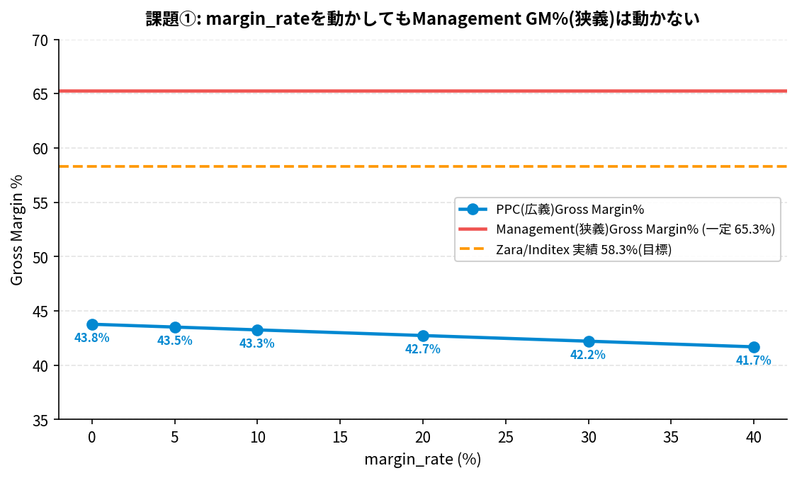

# 課題① cost_plus方式のmargin_rate感応度分析

## 課題文
`ppc_transfer_price_rule.csv` の `margin_rate`（現在0.10）を変化させ、Apparel_Integrated
の Management Gross Margin% が Zara/Inditex の実績値（58.3%）にどこまで近づけられるか
試算してみましょう。

## 模範解答

### 結論
**margin_rateをどれだけ動かしても、Management(狭義)Gross Margin%は65.3%のまま一切動きません。**
動くのはPPC(広義)Gross Margin%だけで、しかも margin_rate を上げるほど58.3%からは
遠ざかります（下がる方向）。

| margin_rate | PPC(広義)GM% | Management(狭義)GM% |
|---:|---:|---:|
| 0% | 43.78% | 65.31%（不変） |
| 5% | 43.52% | 65.31%（不変） |
| 10%（現行） | 43.26% | 65.31%（不変） |
| 20% | 42.73% | 65.31%（不変） |
| 30% | 42.21% | 65.31%（不変） |
| 40% | 41.69% | 65.31%（不変） |



### なぜ動かないのか
`wom/engine/money.py` の Management engine は

```
COGS = demand_fulfilled × unit_cost
```

という式を使い、`unit_cost` は `sku_master.csv` に**あらかじめ焼き込まれた静的な値**
です。Apparel_Integrated (`cost_plus`方式) の場合、この `unit_cost` は
`tools/gen_apparel_model.py` の `gen_sku_master()` 内で

```python
unit_cost = brand["fabric_unit_cost"] + brand["conversion_cost"]  # margin抜き
```

として生成されており、`margin_rate` の値を一切参照していません。一方、実際の
Transfer Price（工場出荷価格）は `mom_margin_rate` を使って
`(fabric + conversion) × (1 + margin_rate)` として `node_cost_master.csv` に
別途書き込まれており、これは PPC engine (`wom/ppc/ppc_transfer.py` 経由で
`ppc_transfer_price_rule.csv` の `margin_rate` を実行時に参照) の計算にのみ影響します。

つまり `margin_rate` は「PPCエンジンが使う実際の工場出荷価格」だけを動かし、
「Managementエンジンが使う固定原価」には一切波及しない — という、第6回記事の
おわりに・第3章で解説した"二重スコープ"設計そのものが、この演習でも実証されます。

### Zara実績58.3%に近づけるには
- Management(狭義)は現状65.3%で**すでに実績値を上回っており**、margin_rateではこれ以上
  下げられません（そもそもmargin_rateの影響を受けない）。
- PPC(広義)は0%でも43.8%までしか届かず、58.3%とは14.5pt以上の開きがあります。
- **結論**: margin_rateの調整だけでは58.3%に到達しません。Zara/Inditexの開示する
  「売上総利益率」がWOMのどちらのスコープにも厳密には一致しない（実企業のGAAP開示は
  さらに別の按分ルールを持つ）ことを示す、良いリアリティチェックです。定義を厳密に
  揃えたい場合は `unit_cost` の生成ロジック自体（`gen_sku_master()`）を変更する必要が
  ありますが、それは本記事の「おわりに」で述べた通り、Managementエンジンの設計意図
  （工場出荷時点で評価する）を壊すため推奨しません。

## 再現方法
```bash
cd wom-v1r1m8
python3 data/sample/apparel-us-2026/exercises/ex1_margin_rate_sensitivity/reproduce.py
```
`result.csv` に同じ結果が保存されています。スクリプトは `ppc_transfer_price_rule.csv`
の一時コピーを操作するだけで、リポジトリの実ファイルは変更しません。
