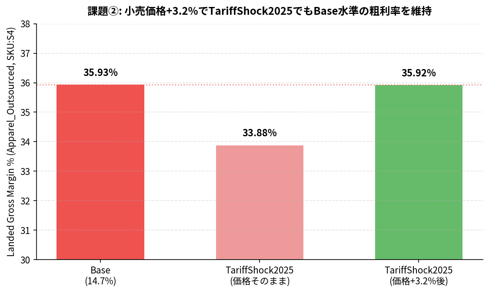

# 課題② 関税ショックの損益分岐点分析

## 課題文
`ppc_market_price.csv` の小売価格をどこまで引き上げれば、TariffShock2025シナリオでも
Apparel_Outsourcedの粗利率がBaseシナリオ水準を維持できるか計算してみましょう。

## 模範解答

### 結論
**小売価格を +3.2%（$49.00 → 約$50.57）引き上げれば、TariffShock2025下でも
Base水準のLanded Gross Margin 35.9%を維持できます。**

| シナリオ | 売上高 | Landed GM% |
|---|---:|---:|
| Base（関税14.7%） | $1,170,316 | 35.93% |
| TariffShock2025（関税20.0%、価格そのまま） | $1,170,316 | 33.88% |
| TariffShock2025（関税20.0%、価格+3.2%後） | $1,207,858 | 35.92% |



### 重要な注意: 課題文の`ppc_market_price.csv`では効果ゼロ
実際に検証したところ、`ppc_market_price.csv` の `market_price` を+10%引き上げても、
このLanded Cost（第5回記事の「関税シナリオ感応度」表）の数値は**一切変化しません**
（$1,170,316のまま）。

理由は、この表のrevenueが `wom/engine/money.py` の Management engine
（`evaluate_money()`）経由で計算されており、その価格ソースは `sku_master.csv` の
`selling_price` 列だからです。`ppc_market_price.csv` はPPC engine（Cost Waterfall・
Node P&Lなど）が参照する別の価格ソースであり、Landed Cost分析には接続されていません。

損益分岐点を実際に動かすには、**`sku_master.csv` の `selling_price` 列を変更する必要が
あります**。これも課題①と同じく、WOMの二重エンジン設計（ManagementとPPCが別々の
価格・原価ソースを持つ）が生む「落とし穴」です。演習を通じて、どちらの数値をどちらの
CSVで動かすべきか、実際に手を動かして確かめてもらうのが狙いです。

### 計算方法
Landed Cost engine（`wom/engine/landed_cost.py`）では

```
customs_duty = cogs × tariff_rate
landed_cogs  = cogs + customs_duty + freight_total + assembly_total
landed_gm    = (revenue - landed_cogs) / revenue
```

freight_total・assembly_totalはシナリオに関わらず一定（tariff_rateだけが変数）なので、
目標GM%を達成するのに必要なrevenue R' は

```
R' = landed_cogs_shock / (1 - target_gm)
   = $773,842 / (1 - 0.3593)
   = $1,207,858
価格上昇率 = R'/R - 1 = +3.2%
```

で解析的に求まり、二分探索で実際に `sku_master.csv` の `selling_price` を動かして
再計算した結果とも一致することを確認済みです（+3.20% → landed_gm 35.92%、目標35.93%
に対し誤差0.01pt）。

## 再現方法
```bash
cd wom-v1r1m8
python3 data/sample/apparel-us-2026/exercises/ex2_tariff_breakeven_price/reproduce.py
```
`result.csv` に最終結果を保存。スクリプトは `sku_master.csv` のインメモリコピーを
操作するだけで、リポジトリの実ファイルは変更しません。
