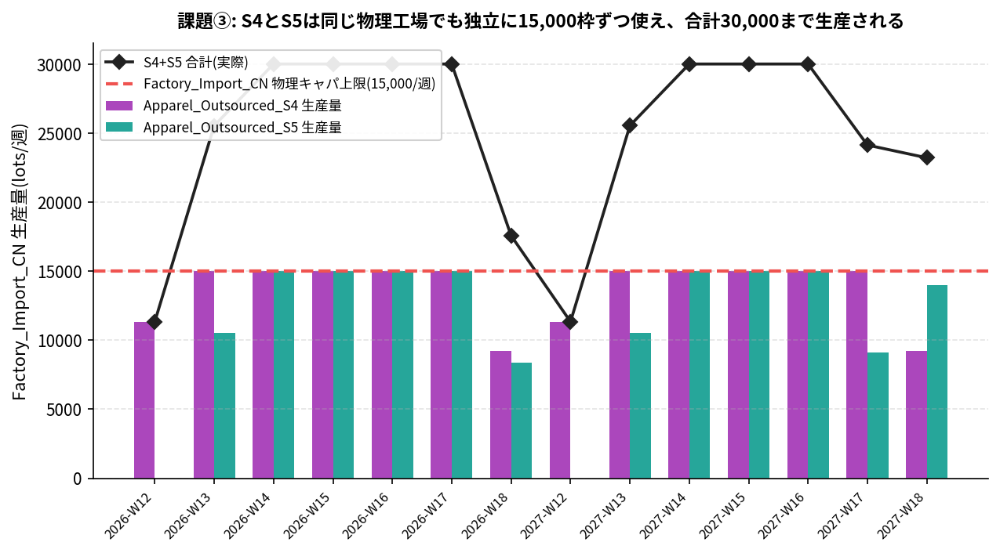

# 課題③ 季節重複時のキャパシティ競合検証

## 課題文
`demand_forecast.csv` を操作し、複数シーズン（例: S4とS5）の需要期を意図的に重ねた場合、
Factory_Import_CN/Factory_Local_ESのキャパシティ判定がSKU横断で合算されるか、SKU単位で
独立に判定されるかを検証してみましょう。

## 模範解答

### 結論
**SKU単位で完全に独立に判定されます。合算されません。**

S4とS5の需要期を完全に重ね（需要量も8倍に増幅してキャパシティ上限に迫るようにした
上で）シミュレーションを実行すると、同じ物理工場 `Factory_Import_CN`（実際のキャパシティ
上限は15,000 lots/週の1本）に対して、S4が15,000、S5も同時に15,000、**合計30,000/週**
まで生産計画が成立してしまいます。

| 週 | S4生産量 | S5生産量 | 合計 | 物理キャパ上限 |
|---|---:|---:|---:|---:|
| 2026-W14 | 15,000 | 15,000 | **30,000** | 15,000 |
| 2026-W15 | 15,000 | 15,000 | **30,000** | 15,000 |
| 2026-W16 | 15,000 | 15,000 | **30,000** | 15,000 |
| 2027-W14 | 15,000 | 15,000 | **30,000** | 15,000 |
| 2027-W15 | 15,000 | 15,000 | **30,000** | 15,000 |
| 2027-W16 | 15,000 | 15,000 | **30,000** | 15,000 |



### 原因（コード上の根拠）
`sc_tree_master.csv` は、8つの季節限定SKUごとにSC Treeを**完全に複製**して構築されます
（`wom/engine/sc_tree_builder.py`）。そのため `Factory_Import_CN` という同じ
`node_name` を持っていても、S4用とS5用では**別々の独立した `PlanNode` インスタンス**
が生成されます。

```python
matches = [nd for nd in sc_tree.iter_all_nodes("Apparel_Outsourced_S4")
           if nd.node_name == "Factory_Import_CN"]
# -> 1件のみ。S5用のFactory_Import_CNとは別オブジェクト。
```

キャパシティのCapHardシーリング（`wom/engine/forward_planner.py` の `_process_node()`、
Step 0a）は、このPlanNodeインスタンス単位で `P[w]` を `cap_hard` に切り詰める処理です。
S4用インスタンスとS5用インスタンスは互いを一切参照しないため、それぞれが独立に
15,000という上限まで使い切ってしまいます。

「同じ工場が年間を通じて8つの商品を順番に生産する」というのが本ケースの設計意図
（第2回記事参照）ですが、**季節が重ならない前提でのみ正しく機能する**設計になっており、
需要期が重複するケース（例えば季節切り替えの端境期に前後シーズンの生産が両方走る場合）
では、物理的にありえない二重予約を検知できません。教材としては、この限界を実際に
手を動かして発見してもらうのが狙いです。

### 副次的な発見: capacity_plan.csvの週カバレッジ・ギャップ
検証中に、`capacity_plan.csv` は「需要が発生する週」のみをカバーしており、実際に
**生産が発生する週**（リードタイム分だけ手前）の行が存在しないことも分かりました。
`cap_hard=0` は「無制約」を意味するため、このギャップがある限り、生産週では
そもそもキャパシティ制約自体が効いていません。本検証では `Factory_Import_CN` の
`cap_hard` を全105週に明示設定してこの問題を回避していますが、実運用では
`capacity_plan.csv` 自体を生産週まで拡張するのが正しい対処です。

### 改善の方向性
物理的に共有される工場・DCについては、SKUごとに独立した `cap_hard` を持たせるのでは
なく、「共有キャパシティプールID」のような概念を `capacity_plan.csv` / `node_master.csv`
に追加し、そのプールに属する全SKUの合計を1つの上限でシーリングする仕組みが必要です。
課題④（店舗共有パターンの設計）とも直結する論点です。

## 再現方法
```bash
cd wom-v1r1m8
python3 data/sample/apparel-us-2026/exercises/ex3_capacity_overlap/reproduce.py
```
`result.csv` に週別の生産量内訳を保存。スクリプトは需要データをインメモリで操作する
だけで、リポジトリの実ファイルは変更しません。
